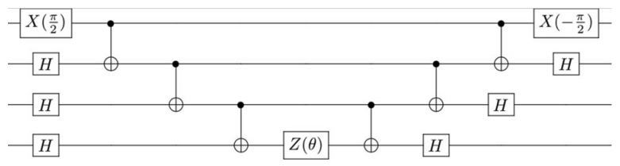

# Variational Algorithms

# Chemistry Goals 
* Code up the ucc1 circuit, note the pattern, use compute action
* Show Hamiltonian creation using createOperator with pyscf
* Show operatorTransform with JW
* Define an OptFunction, show off kernel::observe() -> <psi(x) | H | psi(x)>
* Show optimization, use Scikit-quant default
* print the energy
* Then show off how you could code it up from the exp() expression
* Use createObjectiveFunction() with gradients
* Then show operatorTransform with symmetry reduction
* You'll need a 1-qubit ansatz, so make a lambda...
* Show Python version

# QITE Goals
* Show the use of QuaSiMo for QITE
* In particular, show that we can integrate BQSKit qsearch as a circuit optimizer
* Run with verbose on, see circuit reductions
* Show Python, note that we can use 3rd party libs for Operators